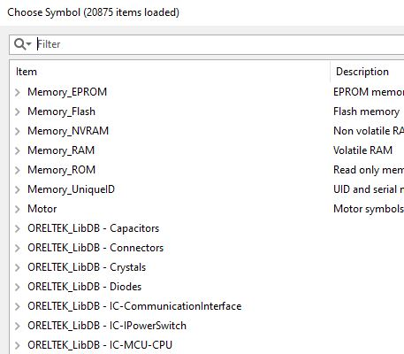

# KiCad_DB_Lib_Creator
SQL tabanlı hazır veritabanı kütüphanelerinizi (Altium vb. ) KiCad Database Library'e dönüştürmek için kullanabilirsiniz.

Not: Kullanımından doğacak hataların sorumlusu kullanıcılardır. Sorumluluk kabul edilmez. Kendinize göre düzenleyip kullanabilirsiniz.

[ENG]

You can use your SQL-based database libraries (Altium etc.) to convert them to KiCad Database Library.

Note: Users are responsible for errors arising from its use. No liability is accepted. You can customize and use it.

